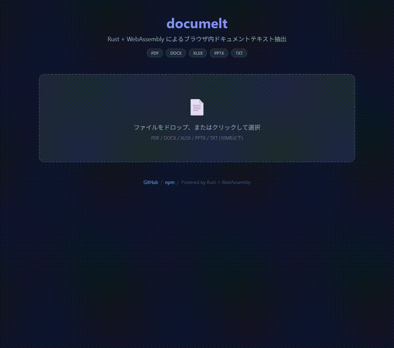

# documelt

[](https://www.npmjs.com/package/documelt)
[](https://opensource.org/licenses/MIT)
[](https://github.com/NAOHIDEOTA/documelt)

**Rust + WebAssembly** によるブラウザ向けドキュメントテキスト抽出ライブラリ。

サーバーに依存せず、**ブラウザ上で** PDF・Word・Excel・PowerPoint からテキストを高速に抽出します。

**[Live Demo](https://naohideota.github.io/documelt/docs)**



## Features

- **ブラウザ完結** — サーバーサイド不要。WASMがブラウザ内でテキスト抽出を実行
- **高速** — Rustコンパイルによるネイティブ級パフォーマンス（PDFは0.2秒、DOCX/XLSXは数ms）
- **ページ単位の抽出** — PDF→ページ、PPTX→スライド、XLSX→シートごとに配列で返却
- **Web Worker対応** — メインスレッドをブロックしない非同期処理
- **メタデータ付き** — ファイル名、サイズ、ページ数、文字数、処理時間を自動計測
- **TypeScript** — 完全な型定義付き

## Supported Formats

| Format | Engine                                              | Output                                 |
| ------ | --------------------------------------------------- | -------------------------------------- |
| PDF    | [pdf-extract](https://crates.io/crates/pdf-extract) | ページごとのテキスト配列               |
| DOCX   | ZIP + XML parse                                     | ドキュメント全体のテキスト             |
| XLSX   | [calamine](https://crates.io/crates/calamine)       | シートごとのテキスト配列（タブ区切り） |
| PPTX   | ZIP + XML parse                                     | スライドごとのテキスト配列             |
| TXT    | UTF-8 decode                                        | そのままのテキスト                     |

> **Note:** スキャンPDFやアウトライン化されたPDF（テキストがベクターパスとして埋め込まれたもの）はテキスト抽出できません。OCRが必要なケースはサーバーサイドでの処理を推奨します。

## Installation

```bash
npm install documelt
```

## Quick Start

```typescript
import { extractFromFile } from "documelt";

// ファイル選択イベントから
const input = document.querySelector<HTMLInputElement>("#file");
input.addEventListener("change", async () => {
  const result = await extractFromFile(input.files[0]);

  if (result.success) {
    // ページ単位の配列
    console.log(result.texts); // ['Page 1 text...', 'Page 2 text...', ...]

    // 全文を1つの文字列として
    console.log(result.texts.join("\n"));

    // メタデータ
    console.log(result.meta);
    // { filename: 'doc.pdf', extension: 'pdf', size: 204800, pages: 5, characters: 12000, time: 0.15 }
  } else {
    console.error(result.error);
  }
});
```

WASM の初期化は初回呼び出し時に自動で行われます。`init()` を明示的に呼ぶ必要はありません。

### Markdown 出力

`format: 'markdown'` を指定すると、**`texts` の各要素が Markdown 文字列になります**。返り値の形は変わらないので、使い方はそのままです。

```typescript
const result = await extractFromFile(file, { format: "markdown" });

console.log(result.texts); // ページ単位の Markdown 配列
console.log(result.texts.join("\n")); // 全文を1つの Markdown 文字列で
```

ページ・スライド・シートは**配列の要素**として表現され、`## Page 1` のような見出しは本文に挿入されません。

変換される要素：

| 要素                 | DOCX |     PPTX     |     XLSX     | PDF / TXT |
| -------------------- | :--: | :----------: | :----------: | :-------: |
| 見出し `#`           |  ○   | ○ (タイトル) | ○ (シート名) |    －     |
| 表 `\|`              |  ○   |      ○       |      ○       |    －     |
| リンク `[text](url)` |  ○   |      ○       |      ○       |    －     |
| 太字 `**` / 斜体 `*` |  ○   |      ○       |      ○       |    －     |
| 取り消し線 `~~`      |  ○   |      ○       |      －      |    －     |
| ハイライト `==`      |  ○   |      ○       |      －      |    －     |
| リスト `-` / `1.`    |  ○   |      ○       |      －      |    －     |

`format` を省略するか `'text'` を指定すると、従来どおりプレーンテキストが返ります。**プレーンテキストには Markdown 記法は一切含まれません。**

> **PDF について** — 使用している `pdf-extract` はページ単位の文字列しか返さず、フォント情報や文字座標を公開していません。そのため PDF では表・装飾・リンクを復元できず、Markdown 出力もプレーンテキストと同じ内容になります。

## Usage

### Browser (Main Thread)

```typescript
import { extract, extractFromFile, isSupported } from "documelt";

// File API から
const result = await extractFromFile(file);

// Uint8Array + 拡張子を直接指定
const result = await extract(uint8Array, "pdf", "report.pdf");

// 対応フォーマット判定
isSupported("report.pdf"); // true
isSupported("image.png"); // false
```

### Browser (Web Worker)

大きなファイルの処理でメインスレッドのブロックを避けたい場合に使用します。

```typescript
import { DocumeltWorker } from "documelt";

const worker = new Worker(new URL("documelt/worker", import.meta.url), {
  type: "module",
});
const client = new DocumeltWorker(worker);

const result = await client.extractFromFile(file);
console.log(result.texts);

// 不要になったら終了
client.terminate();
```

### Node.js

```typescript
import { readFileSync } from "fs";
import { initWithBytes, extract } from "documelt";

// Node.js では WASM バイナリを手動で初期化
initWithBytes(readFileSync("node_modules/documelt/pkg/documelt_bg.wasm"));

const data = new Uint8Array(readFileSync("./document.pdf"));
const result = await extract(data, "pdf", "document.pdf");
console.log(result.texts.join("\n"));
```

## API Reference

### Extraction

| Function                                                                                             | Description                                                  |
| ---------------------------------------------------------------------------------------------------- | ------------------------------------------------------------ |
| `extractFromFile(file: File, options?: ExtractOptions)`                                              | ブラウザの `File` オブジェクトからテキストを抽出             |
| `extract(data: Uint8Array, extension: SupportedFormat, filename?: string, options?: ExtractOptions)` | バイナリデータから抽出。戻り値は `Promise<ExtractionResult>` |
| `isSupported(fileName: string)`                                                                      | 対応フォーマットか判定。戻り値は `boolean`                   |

`ExtractOptions`：

| Field    | Type                   | Description                                                                         |
| -------- | ---------------------- | ----------------------------------------------------------------------------------- |
| `format` | `'text' \| 'markdown'` | `'markdown'` を指定すると `texts` の各要素が Markdown になる（デフォルト `'text'`） |

### Initialization

通常は自動初期化されるため呼ぶ必要はありません。

| Function                                 | Description                               |
| ---------------------------------------- | ----------------------------------------- |
| `init(wasmUrl?: string \| URL)`          | WASM を手動で非同期初期化（プリロード用） |
| `initWithBytes(wasmBytes: BufferSource)` | WASM バイナリを同期初期化（Node.js 向け） |

### Worker

| API                                          | Description                 |
| -------------------------------------------- | --------------------------- |
| `new DocumeltWorker(worker: Worker)`         | Worker クライアントを作成   |
| `client.extract(data, extension, filename?)` | Worker 経由で抽出           |
| `client.extractFromFile(file)`               | Worker 経由で File から抽出 |
| `client.terminate()`                         | Worker を終了               |

### Constants

| Name                | Value                                    |
| ------------------- | ---------------------------------------- |
| `SUPPORTED_FORMATS` | `['pdf', 'docx', 'xlsx', 'pptx', 'txt']` |

## Types

```typescript
interface ExtractionResult {
  texts: string[]; // ページ/シート/スライドごとのテキスト配列
  success: boolean; // 抽出成功フラグ
  error: string | null; // エラーメッセージ（成功時 null）
  meta: ExtractionMeta; // メタデータ
}

interface ExtractOptions {
  // 'markdown' を指定すると texts の各要素が Markdown になる（デフォルト 'text'）
  format?: "text" | "markdown";
}

interface ExtractionMeta {
  filename: string; // ファイル名
  extension: SupportedFormat; // 拡張子
  size: number; // ファイルサイズ（bytes）
  pages: number; // ページ数（PDF/PPTX/XLSX）
  characters: number; // 総文字数
  time: number; // 処理時間（秒）
}

type SupportedFormat = "pdf" | "docx" | "xlsx" | "pptx" | "txt";
```

## Performance

WASM バイナリサイズ: **~1.2MB**

| Format | File Size | Pages     | Characters | Time   |
| ------ | --------- | --------- | ---------- | ------ |
| TXT    | 209B      | 1         | 75         | 0.001s |
| PDF    | 2.3MB     | 31        | 4,802      | 0.21s  |
| DOCX   | 30KB      | 1         | 4,461      | 0.002s |
| XLSX   | 18KB      | 3 sheets  | 4,492      | 0.004s |
| PPTX   | 44MB      | 31 slides | 4,059      | 0.02s  |

## Limitations

- **スキャンPDF / アウトラインPDF** — テキストがベクターパスや画像として埋め込まれたPDFは抽出不可（OCR が必要）
- **パスワード保護ファイル** — 暗号化されたファイルは非対応
- **ファイルサイズ** — ブラウザメモリに制約あり。10MB 以下を推奨
- **PDF の構造** — PDF は表・装飾・リンクを Markdown に変換できない（テキストのみ）

## Contributing

[GitHub Issues](https://github.com/NAOHIDEOTA/documelt/issues) でバグ報告・機能リクエストを受け付けています。

## License

[MIT](LICENSE) - Copyright (c) 2026 NAOHIDEOTA
